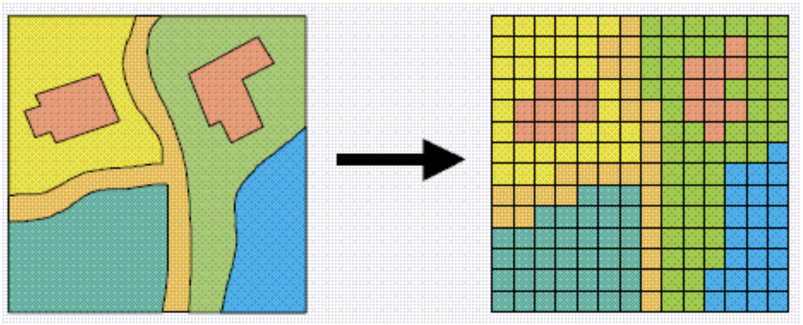

# Tutorial: Overlay vs Rasterize in GIS

In Geographic Information Systems (GIS), understanding overlay vs. raster data is crucial for working with spatial data effectively. This tutorial will explain both concepts, their differences, and use cases.

## What is Overlay in GIS?

Overlay in GIS refers to the process of combining multiple spatial layers to analyze relationships between features. This technique allows you to compare and analyze data by layering it together.

Overlays can be done with both raster and vector data.

### Types of Overlay Operations:

Intersection: Retains features common to both layers.

* Union: Combines all features from both layers.
* Difference: Retains features from one layer that do not overlap the other.
* Symmetrical Difference: Features that occur in either layer but not in both.

A useful visualization of overlay operations is shown in the following diagram from [Bplewe - Own work, CC BY-SA 4.0](https://commons.wikimedia.org/w/index.php?curid=111799357).

### Use Case Example:

By overlaying data layers like elevation, slope angle, slope type, flow accumulation, geology, and vegetation, we can develop a landslide susceptibility map. The following example is from [Kohno, Masanori & Higuchi, Yuki. (2023)](https://www.researchgate.net/publication/367345548_Landslide_Susceptibility_Assessment_in_the_Japanese_Archipelago_Based_on_a_Landslide_Distribution_Map).

## What is Rasterization in GIS?

Rasterization is the process of converting vector data (points, lines, polygons) into raster format. Raster data represents spatial information as a grid of cells, each containing a value representing a characteristic.

Rasterization works by assigning each cell in a grid gets a value based on the vector data it overlaps. The resolution (cell size) determines the level of detail.

## Use Case Example:

Converting a land parcel vector map into a raster to perform terrain analysis or modeling in environmental studies.

The following diagram from [ArcGIS](https://desktop.arcgis.com/en/arcmap/latest/manage-data/geodatabases/raster-basics.htm) shows how a series of polygons can be represented in raster form.

## Key Characteristics:

Rasterization converts vector data into raster format. It's commonly used for continuous data representation like elevation or temperature.

## When to Use Overlay vs Rasterize?

Use Overlay when working with feature-based analysis like identifying overlapping regions, intersections, and unions.

Use Rasterize when you need continuous data for processes like remote sensing, elevation modeling, or spatial interpolation.

# Wrap-up

Both Overlay and Rasterize are fundamental GIS techniques used for different types of spatial analysis. Both are important tools in your GIS toolbox and you will likely use them both when tackling GIS projects.

